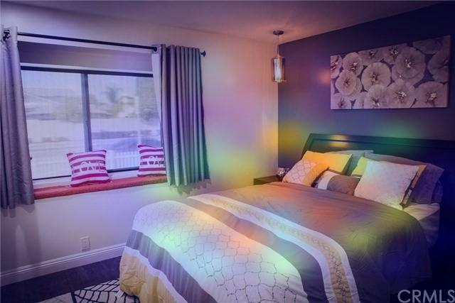

# ml-cnn-keras-Interpretability

## Thanks to [Anna Renau](https://es.linkedin.com/in/anna-renau-rosell) for her contributions and support

## Based on

- [Tensorflow Retraining an Image Classifier](https://www.tensorflow.org/hub/tutorials/tf2_image_retraining)
- [Grad-CAM class activation visualization](https://keras.io/examples/vision/grad_cam/)
- [EfficientNetV2: Smaller Models and Faster Training](https://arxiv.org/abs/2104.00298)
- [tf.keras.applications.efficientnet_v2.EfficientNetV2S](https://www.tensorflow.org/api_docs/python/tf/keras/applications/efficientnet_v2/EfficientNetV2S)
 

## Streamlit App for testing the model

- [Streamlit App for testing](https://share.streamlit.io/nikeyes/ml-cnn-keras-interpretability/main/app/app.py)

## Training Data - Rooms Dataset 

- [https://www.kaggle.com/robinreni/house-rooms-image-dataset](https://www.kaggle.com/robinreni/house-rooms-image-dataset)
- [https://github.com/emanhamed/Houses-dataset](https://github.com/emanhamed/Houses-dataset)

- You can download curated dataset with this images from [here](https://drive.google.com/file/d/1PzoQAvOcXDwEmNAj_rGnTXSfu8GPuUvR/view?usp=sharing) and unzip on *training_data* folder.

- You can download a final validation dataset with rooms photos of friends and family from [here](https://drive.google.com/file/d/1mChroZdAmg3LEVbgXead_h6bPMQu37bG/view?usp=sharing) and unzip on *final_validation_data* folder.

## Weights for Training  

- You can use default weights "imagenet" or download especifics weights from [efficientnetv2 github](https://github.com/GdoongMathew/EfficientNetV2/releases/)

- You need to copy your custom heights in a *weights* folder

## Sample result of Grad-CAM algorithm

- Generated with [this notebook](notebooks/03-Interpretability-with-Grad-CAM.ipynb)  

## Model Diagram EfficientNetV2-S

- Generated with [this notebook](notebooks/02-plot-cnn-keras-models.ipynb)

